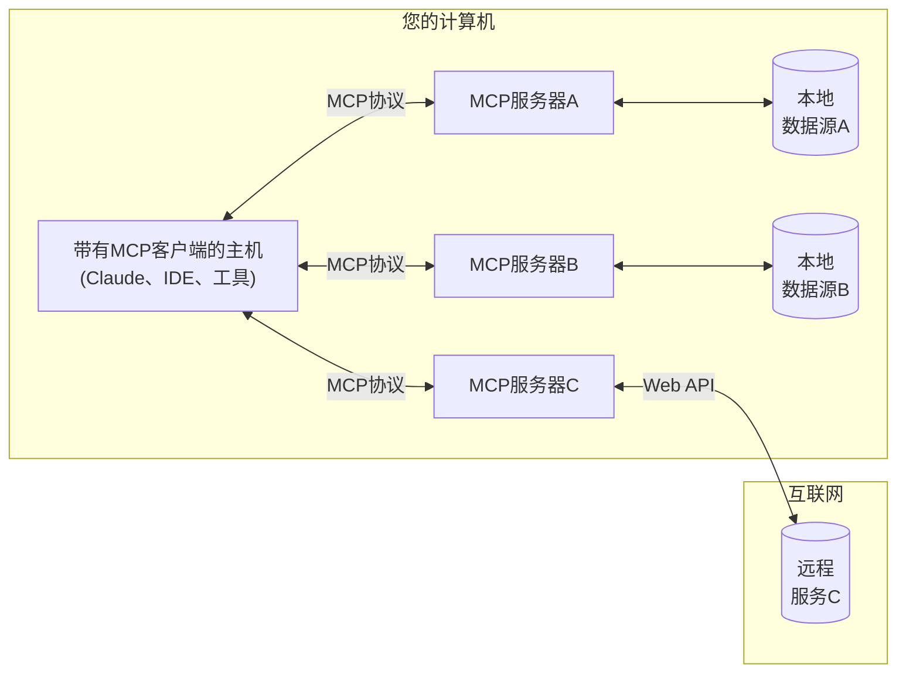

<Note>Java SDK 已发布！查看[最新更新内容](/development/updates)</Note>

MCP是一个开放协议，它规范了应用程序如何向LLMs提供上下文。可以将MCP想象成AI应用程序的USB-C接口。就像USB-C为设备连接各种外设和配件提供了标准化方式一样，MCP为AI模型连接不同的数据源和工具提供了标准化方式。

## 为什么选择MCP？

MCP帮助您在LLMs之上构建代理和复杂工作流。LLMs经常需要与数据和工具集成，而MCP提供：
- 不断增长的预构建集成列表，您的LLM可以直接接入
- 在不同LLM提供商和供应商之间切换的灵活性
- 在您的基础设施内保护数据的最佳实践

### 总体架构

在其核心，MCP遵循客户端-服务器架构，其中主机应用程序可以连接到多个服务器：

- **MCP主机**：想要通过MCP访问数据的程序，如Claude Desktop、IDE或AI工具
- **MCP客户端**：与服务器保持1:1连接的协议客户端
- **MCP服务器**：通过标准化的模型上下文协议暴露特定功能的轻量级程序
- **本地数据源**：MCP服务器可以安全访问的计算机文件、数据库和服务
- **远程服务**：MCP服务器可以连接的互联网上的外部系统（例如，通过API）

## 快速入门

选择最适合您需求的路径：

#### 快速入门指南
<CardGroup cols={2}>
  <Card
    title="服务器开发者"
    icon="bolt"
    href="/quickstart/server"
  >
    开始构建您自己的服务器，以在Claude Desktop和其他客户端中使用
  </Card>
  <Card
    title="客户端开发者"
    icon="bolt"
    href="/quickstart/client"
  >
    开始构建您自己的客户端，可以与所有MCP服务器集成
  </Card>
  <Card
    title="Claude Desktop用户"
    icon="bolt"
    href="/quickstart/user"
  >
    开始在Claude Desktop中使用预构建的服务器
  </Card>
</CardGroup>

#### 示例
<CardGroup cols={2}>
  <Card
    title="示例服务器"
    icon="grid"
    href="/examples"
  >
    查看我们的官方MCP服务器和实现示例库
  </Card>
  <Card
    title="示例客户端"
    icon="cubes"
    href="/clients"
  >
    查看支持MCP集成的客户端列表
  </Card>
</CardGroup>

## 教程

<CardGroup cols={2}>
  <Card
    title="使用LLMs构建MCP"
    icon="comments"
    href="/tutorials/building-mcp-with-llms"
  >
    了解如何使用Claude等LLMs加速您的MCP开发
  </Card>
  <Card
  title="调试指南"
  icon="bug"
  href="/docs/tools/debugging">
    了解如何有效地调试MCP服务器和集成
  </Card>
  <Card
    title="MCP检查器"
    icon="magnifying-glass"
    href="/docs/tools/inspector"
  >
    使用我们的交互式调试工具测试和检查您的MCP服务器
  </Card>
</CardGroup>

## 探索MCP

深入了解MCP的核心概念和功能：

<CardGroup cols={2}>
  <Card
    title="核心架构"
    icon="sitemap"
    href="/docs/concepts/architecture"
  >
    了解MCP如何连接客户端、服务器和LLMs
  </Card>
  <Card
    title="资源"
    icon="database"
    href="/docs/concepts/resources"
  >
    从您的服务器向LLMs暴露数据和内容
  </Card>
  <Card
    title="提示词"
    icon="message"
    href="/docs/concepts/prompts"
  >
    创建可重用的提示词模板和工作流
  </Card>
  <Card
    title="工具"
    icon="wrench"
    href="/docs/concepts/tools"
  >
    使LLMs能够通过您的服务器执行操作
  </Card>
  <Card
    title="采样"
    icon="robot"
    href="/docs/concepts/sampling"
  >
    让您的服务器向LLMs请求补全
  </Card>
  <Card
    title="传输"
    icon="network-wired"
    href="/docs/concepts/transports"
  >
    了解MCP的通信机制
  </Card>
</CardGroup>
## 贡献

想要贡献？查看我们的[贡献指南](/development/contributing)，了解如何帮助改进MCP。

## 支持和反馈

以下是获取帮助或提供反馈的方式：

- 对于MCP规范、SDK或文档（开源）相关的错误报告和功能请求，请[创建GitHub问题](https://github.com/modelcontextprotocol)
- 对于MCP规范相关的讨论或问答，请使用[规范讨论](https://github.com/modelcontextprotocol/specification/discussions)
- 对于其他MCP开源组件相关的讨论或问答，请使用[组织讨论](https://github.com/orgs/modelcontextprotocol/discussions)
- 对于Claude.app和claude.ai的MCP集成相关的错误报告、功能请求和问题，请发送邮件至mcp-support@anthropic.com
